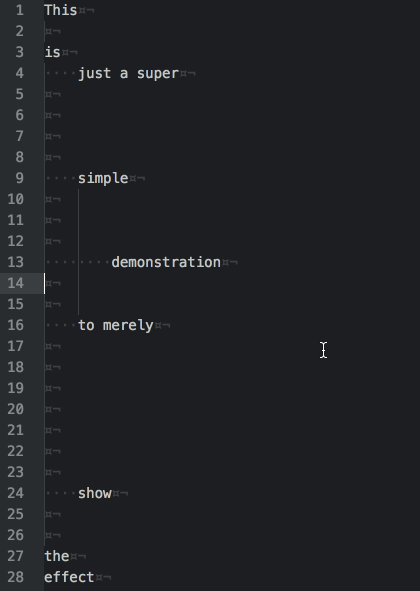

# Strip-Newlines

An [Atom](https://atom.io) text editor package that strips out unnecessary newlines (LF and CRLF) from files.

## `strip-newlines` in Action:

## Description:

* This package simply strips out newlines from source files.  In the settings,
  the user can select how many newlines are ignored before the stripping begins.  
  The default value of ignored newlines is 2.  The reasoning behind using the
  value 2 is we often use one blank line to mark the end of one code block and
  the beginning of another; this blank line consists of two newlines.  Using the
  value of 2 means that these blank lines will not be removed.

## Future Features:

* Ability to strip out newlines from files with mixed newlines and keep the
  original mixture of newlines intact.

## Bug(s):

* Strange new bug that shows when running code - it causes some lines to indent
* Certain edge cases will cause the stripping to not work correctly
* Minimum value (0) may still allow for values below 0 - unsure.

## TODO:
